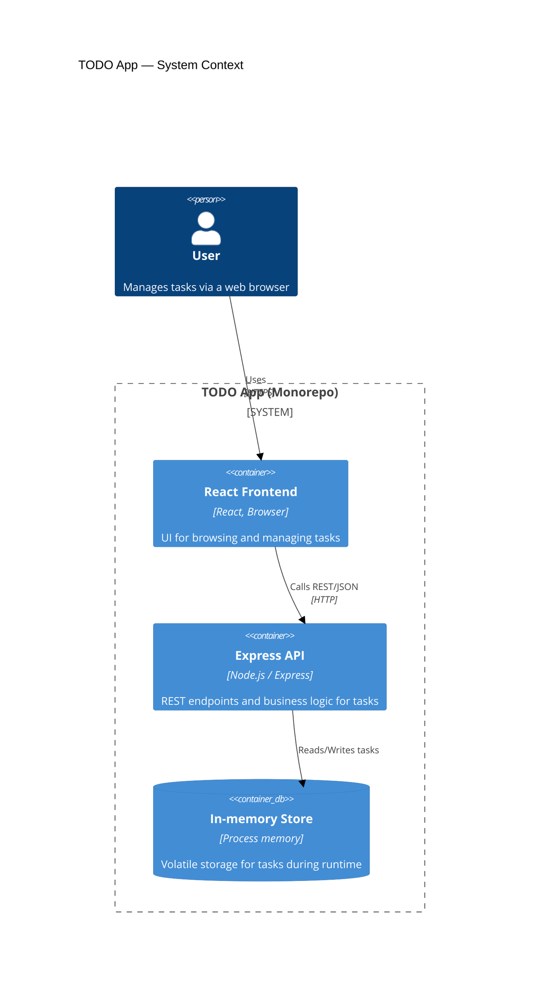
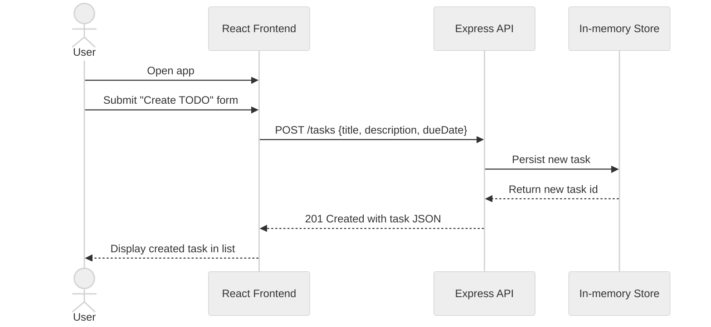

# Cloud Architecture Overview

This document provides a simple system context view of the TODO App monorepo, showing the React frontend, Express API, and in-memory data store.

## Sequence: Create TODO

This sequence shows a user creating a new TODO item via the React frontend and Express API.

 
